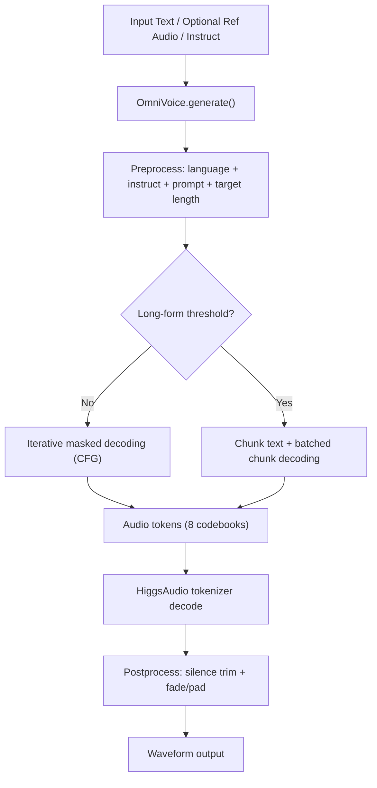

# OmniVoice Repository Knowledge (Deep Analysis)

Updated: 2026-05-12  
Scope: static code + docs analysis of the current `master` working tree (không chạy train/infer thực tế trong lần phân tích này).

## 1. Executive Summary

OmniVoice là một hệ thống TTS đa ngôn ngữ rất lớn (README mô tả 600+, docs `languages.md` liệt kê 646 ngôn ngữ) xây theo kiến trúc diffusion language model style trên discrete audio token (8 codebooks). Repo này đã bao gồm:

- Inference đầy đủ: Python API, CLI single/batch, Gradio demo.
- Training pipeline đầy đủ: config-driven, `accelerate`, checkpointing, optional DeepSpeed.
- Data pipeline thực chiến: JSONL/WebDataset -> tokenize -> train; có cả denoise và noise/RIR augmentation.
- Evaluation pipeline theo benchmark: WER, speaker similarity (SIM-o), UTMOS.

Điểm mạnh chính: kiến trúc code gọn theo module, pipeline từ data đến eval khá liền mạch.  
Điểm cần lưu ý: chưa có test suite/CI workflow trong repo; phụ thuộc nặng vào GPU và môi trường ngoài (dataset/model checkpoints).

## 2. Repository Map

```text
OmniVoice/
├── omnivoice/
│   ├── models/            # Core model (OmniVoice)
│   ├── cli/               # demo / infer / infer_batch / train
│   ├── training/          # builder, trainer, config, checkpoint
│   ├── data/              # dataset readers, batching, collators, processor
│   ├── scripts/           # data preprocessing/packing/tokenization/denoise
│   ├── eval/              # WER, MOS, speaker similarity
│   └── utils/             # audio/text/lang/duration helpers
├── docs/                  # user docs + notebook
├── examples/              # shell pipelines for train/finetune/eval
├── pyproject.toml
└── README.md
```

## 3. Tech Stack & Packaging

- Python >= 3.10 (`pyproject.toml`)
- Core deps: `torch`, `torchaudio`, `transformers`, `accelerate`, `gradio`, `webdataset`
- Eval extras: `jiwer`, `s3prl`, `funasr`, `zhconv`, `zhon`, `unidecode`
- Entry points:
  - `omnivoice-infer`
  - `omnivoice-infer-batch`
  - `omnivoice-demo`

`uv` được cấu hình để pin PyTorch/Torchaudio 2.8.0 và ưu tiên CUDA wheels cho Linux/Windows.

## 4. Core Model Architecture (`omnivoice/models/omnivoice.py`)

### 4.1 Structural Design

- `OmniVoice` extends `PreTrainedModel`.
- Backbone LLM (`self.llm`) + audio embedding/head:
  - `audio_embeddings`: embedding cho token của 8 codebook layers.
  - `audio_heads`: projection từ hidden state -> logits cho toàn bộ audio codebooks.
- `OmniVoiceConfig` chứa:
  - `audio_vocab_size=1025`, `audio_mask_id=1024`, `num_audio_codebook=8`
  - `audio_codebook_weights` để weighted loss theo layer.

### 4.2 Input Representation

Model nhận `input_ids` shape `[B, C, L]`:
- text token nằm ở layer 0 (via tokenizer),
- audio token nằm trên các codebook layers.

`_prepare_embed_inputs()`:
- text embedding lấy từ LLM embedding layer.
- audio token được shift theo `codebook_layer_offsets`.
- tổng hợp embedding audio across codebooks rồi `torch.where(audio_mask, audio_embeds, text_embeds)`.

### 4.3 Training Forward

`forward()`:
- build flex-attention block mask từ `document_ids` nếu dùng packing (`flex_attention`).
- chạy LLM -> hidden states -> `audio_heads`.
- reshape logits thành `[B, C, S, Vocab]`.
- loss = CE trên masked audio positions, weighted theo `audio_codebook_weights`.

### 4.4 Inference Pipeline

`generate()` có 3 mode:
- voice cloning (`ref_audio` + optional `ref_text`)
- voice design (`instruct`)
- auto voice (không prompt)

Luồng chính:
1. `_preprocess_all()` chuẩn hoá text/language/instruct/prompt/speed/duration.
2. chia short vs long bằng `audio_chunk_threshold`.
3. short -> `_generate_iterative()`
4. long -> `_generate_chunked()`
5. decode token -> waveform + postprocess.

### 4.5 Iterative Masked Decoding

Trong `_generate_iterative()`:
- tạo cond + uncond branches (CFG) cho từng item.
- chạy N bước unmask (`num_step`), mỗi bước:
  - lấy logits cond/uncond,
  - CFG combine,
  - chọn token theo confidence + penalties + temperature,
  - unmask top-k positions theo schedule thời gian (`_get_time_steps`).

Đây là hạt nhân “diffusion language model-style” của inference.

### 4.6 Long-Form Generation

`_generate_chunked()`:
- chunk text bằng punctuation (`chunk_text_punctuation`).
- batch theo chunk index để tiết kiệm VRAM.
- nếu không có reference audio: chunk đầu làm “pseudo reference” cho các chunk sau.
- decode chunks rồi cross-fade (`cross_fade_chunks`).

### 4.7 Voice Clone Prompt

`create_voice_clone_prompt()`:
- load/resample/mono hóa audio.
- optional preprocess: trim long silence + remove silence.
- optional ASR auto-transcribe (`Whisper`) nếu thiếu `ref_text`.
- encode audio bằng `HiggsAudioV2TokenizerModel`.

## 5. Training System

## 5.1 Entry

`omnivoice/cli/train.py`:
- load `TrainingConfig` từ JSON.
- `build_model_and_tokenizer()`
- `build_dataloaders()`
- `OmniTrainer(...).train()`

## 5.2 Data Processing Logic

`OmniVoiceSampleProcessor`:
- style prompt: `<|denoise|>`, language tags, instruct tags.
- text prompt: `<|text_start|>...<|text_end|>`.
- audio masking:
  - `prompt_ratio` cho conditional prefix,
  - `mask_ratio` cho masked token prediction,
  - `drop_cond_ratio` để stochastic unconditional training.
- output tensors: `input_ids`, `labels`, `audio_mask`, `length`.

## 5.3 Two Batching Backends

### A) `flex_attention` path
- `PackingIterableDataset` + `PackingDataCollator`
- pack samples thành một sequence dài `[1, C, L]`
- dùng `document_ids` để block same-document attention.

### B) non-flex path (`sdpa`...)
- `StreamLengthGroupDataset` + `PaddingDataCollator`
- grouped padding thành `[B, C, max_len]`
- tạo 4D attention mask `[B,1,max_len,max_len]`.

## 5.4 Trainer

`OmniTrainer`:
- `Accelerator` + optional DeepSpeed plugin.
- optimizer: AdamW.
- scheduler: cosine hoặc constant + warmup.
- loop có:
  - grad accumulation
  - grad clipping
  - periodic logging/eval/save
  - resume checkpoint
- checkpoint gồm:
  - accelerator state
  - HF model save_pretrained
  - tokenizer
  - config snapshot

## 6. Data Pipeline & Formats

## 6.1 Canonical Input

JSONL sample:

```json
{"id":"sample_001","audio_path":"/path/a.wav","text":"...","language_id":"en"}
```

## 6.2 Intermediate Training Format

Custom WebDataset layout:
- tar shard chứa `.npy` audio tokens (shape `[8, T]`)
- companion JSONL metadata
- `data.lst`: `<tar_path> <jsonl_path> <num_items> <total_duration>`

## 6.3 Scripts

- `jsonl_to_webdataset.py`: pack raw audio thành `.flac` shards + metadata.
- `extract_audio_tokens.py`: audio -> discrete token shards.
- `extract_audio_tokens_add_noise.py`: thêm prompt noise/RIR augmentation trước tokenize.
- `denoise_audio.py`: denoise bằng Sidon rồi xuất webdataset.

Các script đều support scale-out qua multi-process/GPU, sharding, filtering, error log.

## 7. Inference Interfaces

## 7.1 Single Inference CLI

`omnivoice-infer`:
- mode clone/design/auto.
- hỗ trợ `duration`, `speed`, `num_step`, `guidance_scale`, temperatures...

## 7.2 Batch Inference CLI

`omnivoice-infer-batch`:
- đọc JSONL test list.
- multi-process across GPU.
- clustering theo duration hoặc fixed batch size.
- tách clone samples và non-clone samples để tránh mixed-mode crash.

## 7.3 Gradio Demo

`omnivoice-demo`:
- tab Voice Clone + Voice Design.
- language dropdown 600+.
- optional ASR load control (`--no-asr`, `--asr-model`).

## 8. Evaluation Pipeline

`examples/run_eval.sh` điều phối benchmark theo stage:
- download eval datasets/models
- infer batch
- run metrics scripts:
  - speaker similarity: `omnivoice.eval.speaker_similarity.sim`
  - WER: `hubert` / `seedtts` / `minimax` / `fleurs`
  - MOS: `omnivoice.eval.mos.utmos`

FLEURS path có note dependency conflict với project env (omnilingual-asr), khuyến nghị env riêng.

## 9. Important Runtime Behaviors / Edge Cases

- `duration` override `speed` trong generate.
- `voice_clone_prompt` override `ref_text/ref_audio` nếu truyền đồng thời.
- preprocess prompt có thể làm rỗng audio sau silence removal -> raise lỗi.
- với text dài, chunked generation giữ VRAM gần hằng số.
- `instruct` validator chặt: check typo, mutual exclusivity, accent-vs-dialect conflict.
- unknown language sẽ fallback language-agnostic mode (`None`) với warning.

## 10. Current Gaps & Risks

- Chưa thấy test suite (`tests/`) trong repo.
- Không có CI workflow chạy test/lint trong `.github/workflows` (thư mục workflows không tồn tại trong snapshot hiện tại).
- Nhiều pipeline production-grade phụ thuộc tài nguyên ngoài:
  - HF model/tokenizer caches
  - benchmark datasets
  - GPU memory/driver compatibility (`flex_attention`)

## 11. Suggested Onboarding Flow (Practical)

1. Setup env: `uv sync` (hoặc `pip install -e .` + torch phù hợp).
2. Smoke test inference:
   - `omnivoice-infer` với text ngắn.
3. Chạy demo:
   - `omnivoice-demo --ip 0.0.0.0 --port 8001`
4. Chuẩn bị data theo `docs/data_preparation.md`.
5. Tokenize bằng `extract_audio_tokens`.
6. Train/finetune qua `examples/run_finetune.sh` hoặc `run_emilia.sh`.
7. Eval bằng `examples/run_eval.sh` theo subset benchmark cần thiết.

## 12. Architecture Flow (Mermaid)



## 13. Key Files to Read First

- `omnivoice/models/omnivoice.py` (core model + inference/training forward)
- `omnivoice/training/builder.py` (model/data assembly)
- `omnivoice/training/trainer.py` (train loop)
- `omnivoice/data/processor.py` (masking/conditioning logic)
- `omnivoice/data/collator.py` + `omnivoice/data/batching.py` (batch mechanics)
- `omnivoice/scripts/extract_audio_tokens.py` (data tokenization pipeline)
- `examples/run_finetune.sh` and `examples/run_eval.sh` (end-to-end ops)

